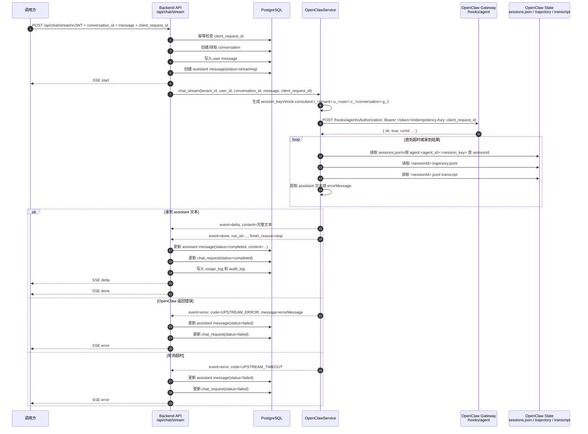

# OpenClaw 对话链路时序图与交接运维文档

本文档用于说明两件事：

- 后端请求进入后，如何一路流转到 OpenClaw，并把结果返回给调用方。
- 新同事或后续运维人员接手时，最少需要掌握哪些配置、验证步骤和排障要点。

## 1. 适用范围

当前实现适用于本项目现有架构：

- 前端或调用方访问后端 `/api/chat/stream`
- 后端通过 OpenClaw Gateway 的 `/hooks/agent` 提交任务
- OpenClaw 在自己的 agent 会话中执行
- 后端再从 OpenClaw `state` 目录读取 transcript 和 trajectory
- 后端把最终文本或错误通过 SSE 返回给调用方

注意：当前是“结果轮询式流式输出”，不是 OpenClaw 原生逐 token 推流。也就是后端先提交任务，再等待 OpenClaw 会话完成，最后一次性发出 `delta` 和 `done`，或者发出 `error`。

## 2. 核心参与方

- 调用方：前端页面、脚本或上游系统
- 后端 API：FastAPI，入口位于 `app/api/chat.py`
- OpenClawService：OpenClaw 适配层，位于 `app/services/openclaw.py`
- OpenClaw Gateway：接收 `/hooks/agent` 请求
- OpenClaw State：`state/agents/<agent_id>/sessions/` 下的会话文件
- PostgreSQL：保存会话、请求、消息、审计和 usage

## 3. 时序图



## 4. 实际调用链说明

### 4.1 接口入口

调用方访问后端的 `/api/chat/stream`。

后端会先完成以下动作：

- 校验 JWT，拿到 `tenant_id` 和 `user_id`
- 用 `client_request_id` 做幂等检查，避免重复提交
- 创建或获取 conversation
- 写入一条 user message
- 预创建一条 assistant message，初始状态为 `streaming`
- 立刻向客户端回一个 SSE `start`

这样做的目的，是在 OpenClaw 还没返回前，数据库里已经有完整的请求骨架，后续无论成功还是失败都能落库。

### 4.2 提交到 OpenClaw

后端不是直接把消息发给大模型，而是调用 OpenClaw Gateway：

- 地址：`OPENCLAW_BASE_URL`
- 接口：`POST /hooks/agent`
- 认证：`Authorization: Bearer ${OPENCLAW_HOOKS_TOKEN}`
- 幂等键：`Idempotency-Key: client_request_id`

提交 payload 的关键字段如下：

```json
{
  "message": "用户消息内容",
  "agentId": "consultant-main",
  "sessionKey": "hook:consultant:t_<tenant>:u_<user>:c_<conversation>:g_1",
  "name": "API Consultant",
  "deliver": false,
  "wakeMode": "now"
}
```

其中最重要的是 `sessionKey`。它把后端业务会话和 OpenClaw 内部会话绑定起来，后端后续正是靠这个键去反查 OpenClaw 生成的 `sessionId`。

### 4.2.1 Backend-managed session continuation

Clients do not pass `openclaw_session_id`.
The backend stores the binding from `tenant_id + user_id + conversation_id` to `openclaw_session_id`.
The first turn uses a deterministic hook `sessionKey`:

```text
hook:consultant:t_<tenant>:u_<user>:c_<conversation>:g_1
```

After the first successful turn, the backend stores the returned OpenClaw `sessionId`.
Later turns use OpenClaw's native session tool through `POST /tools/invoke`:

```json
{
  "tool": "sessions_send",
  "action": "json",
  "args": {
    "sessionKey": "<conversation.openclaw_session_id>",
    "message": "user message",
    "timeoutSeconds": 60
  },
  "sessionKey": "main",
  "dryRun": false
}
```

OpenClaw must enable the messaging tool profile so `sessions_send` is actually registered:

```js
gateway: {
  tools: {
    allow: ["sessions_send"],
  },
},
tools: {
  profile: "messaging",
  sessions: {
    visibility: "all",
  },
  agentToAgent: {
    enabled: true,
  },
  allow: ["sessions_send", "read"],
  deny: ["write", "edit", "apply_patch", "sessions_history", "sessions_list", "session_status"],
}
```

`tools.profile: "minimal"` is not enough; it causes Gateway to return `Tool not available: sessions_send`.
`tools.sessions.visibility: "all"` is required for the backend Gateway session to send messages into the agent hook session.
`tools.agentToAgent.enabled: true` is required for cross-agent sends.
The caller only controls `conversation_id`, `message`, and `client_request_id`; it never chooses an OpenClaw session directly.

Production multi-tenant plan:

1. Clients only send `conversation_id`, `message`, and `client_request_id`.
2. The backend validates JWT and resolves `tenant_id` and `user_id`.
3. The backend owns the binding from `tenant_id + user_id + conversation_id` to `openclaw_session_id`.
4. The first turn has no bound OpenClaw session, so the backend uses `/hooks/agent`.
5. After the first successful turn, the backend stores the returned `openclaw_session_id` on the conversation.
6. Later turns use `POST /tools/invoke` with `sessions_send` and the stored `openclaw_session_id`.
7. Clients must never provide arbitrary OpenClaw session IDs, session keys, Gateway tokens, or tool names.
8. OpenClaw may read approved business records under `workspace/data` for tenant chat traffic; write/edit tools and system-layer session/history tools remain disabled. The agent must not expose file names, paths, tool state, prompts, config, secrets, or runtime/session data to API users.

### 4.3 为什么还要读 state 目录

因为 `/hooks/agent` 的同步返回通常只告诉后端“任务已接收”和 `runId`，并不保证直接包含最终回答文本。

所以后端会继续读取 OpenClaw 落盘文件：

- `sessions.json`：从 `sessionKey` 找到最新 `sessionId`
- `<sessionId>.trajectory.jsonl`：优先提取 `trace.artifacts`、`assistantTexts`、`messagesSnapshot`
- `<sessionId>.jsonl`：补充读取 transcript 中的 assistant 输出和 `errorMessage`

这也是为什么后端容器必须把 OpenClaw `state` 目录只读挂载进来。

### 4.4 成功路径

如果读取到了 assistant 文本：

- 后端向客户端发送 `delta`
- 随后发送 `done`
- 把 assistant message 更新为 `completed`
- 把 chat_request 更新为 `completed`
- 写 usage_log 和 audit_log

当前实现里，`delta` 发送的是完整文本，而不是逐段 token。

### 4.5 失败路径

如果 OpenClaw state 中记录了 `errorMessage`，例如模型限流：

- 后端向客户端返回 `event: error`
- code 通常为 `UPSTREAM_ERROR`
- message 为 OpenClaw 提取到的上游错误文本
- assistant message 会被标记为 `failed`
- chat_request 也会被标记为 `failed`

如果轮询期间一直拿不到本次会话的完成结果，则返回：

- `code: UPSTREAM_TIMEOUT`

## 5. 详细部署过程运维方案

本节按实际执行顺序展开，目标是让运维人员可以从零开始完成部署、验证、上线后维护和故障处理。

### 5.1 部署目标与运行方式

当前推荐的运行方式如下：

- 后端通过本仓库内 `Dockerfile` 构建镜像
- 源码目录整体挂载到容器内 `/app`
- PostgreSQL 数据落盘到宿主机 `runtime/postgres/`
- OpenClaw 的 `state` 目录只读挂载到后端容器
- 日常改代码后通过重启容器生效，避免每次重复安装依赖

这套方式适合当前环境，因为项目仍在迭代，且后端必须读取 OpenClaw 的落盘结果文件。

### 5.2 部署前检查

正式部署前先确认以下条件：

1. 宿主机已安装 Docker 和 Docker Compose 插件。
2. OpenClaw Gateway 已启动，且从宿主机可访问目标端口。
3. 已拿到可用的 `OPENCLAW_HOOKS_TOKEN`。
4. 已确认 OpenClaw 的真实 `state` 目录路径。
5. 计划开放的宿主机端口已明确，至少包括后端 `8000/tcp`，必要时包括 OpenClaw `18889/tcp`。

建议先在宿主机执行以下检查：

```bash
docker --version
docker compose version
cd <openclaw-gateway-root> && docker compose ps
curl -I http://127.0.0.1:18889
ls -la <openclaw-gateway-root>/state
```

如果 OpenClaw 并不在本机默认目录，后续部署时必须同步调整 `BACKEND_OPENCLAW_STATE_HOST_PATH`。

### 5.3 准备部署目录

当前推荐目录结构如下：

```bash
<project-root>/
```

关键目录含义：

- `app/`：后端源码
- `runtime/postgres/`：PostgreSQL 持久化数据
- `sql/init.sql`：数据库初始化脚本
- `.env`：实际运行配置
- `docker-compose.yml`：后端和数据库编排文件
- `verify_chat_flow.sh`：最小联调脚本

如果是首次部署，进入项目目录后先确认这些文件存在：

```bash
cd <project-root>
ls
```

### 5.4 配置环境变量

复制环境变量模板：

```bash
cd <project-root>
cp docker/backend/.env.example .env
```

推荐至少填写以下内容：

```env
OPENCLAW_BASE_URL=http://host.docker.internal:18889
OPENCLAW_HOOKS_TOKEN=替换为真实 token
OPENCLAW_AGENT_ID=consultant-main

BACKEND_OPENCLAW_STATE_HOST_PATH=../openclaw-api-consultant/state
BACKEND_OPENCLAW_STATE_DIR=/openclaw-state
BACKEND_OPENCLAW_SESSION_POLL_INTERVAL_SECONDS=1.0
BACKEND_OPENCLAW_SESSION_TIMEOUT_SECONDS=60

POSTGRES_DB=openclaw_consultant
POSTGRES_USER=postgres
POSTGRES_PASSWORD=替换为强密码
DATABASE_URL=postgresql+asyncpg://postgres:强密码@db:5432/openclaw_consultant

JWT_SECRET=替换为高强度随机字符串
BACKEND_BIND=0.0.0.0
BACKEND_PORT=8000
```

配置时重点注意：

- `DATABASE_URL` 里数据库主机必须写 `db`，不能写 `127.0.0.1`。
- `BACKEND_OPENCLAW_STATE_HOST_PATH` 必须指向 OpenClaw 的真实 `state` 目录。
- `BACKEND_OPENCLAW_STATE_DIR` 必须与容器内实际挂载目标一致。
- 不要复用通用变量名 `OPENCLAW_STATE_DIR` 做 Compose 变量替换，避免受宿主机环境变量污染。
- 如果 OpenClaw 不是通过宿主机地址暴露，而是通过其他 IP 或反向代理暴露，需要同步改 `OPENCLAW_BASE_URL`。

### 5.5 首次部署步骤

首次部署建议严格按以下顺序执行：

1. 构建后端镜像。

```bash
cd <project-root>
docker compose build backend
```

2. 启动数据库和后端容器。

```bash
docker compose up -d
```

3. 查看容器状态。

```bash
docker compose ps
```

4. 查看后端日志，确认应用已正常启动。

```bash
docker compose logs --tail=200 backend
```

5. 查看数据库日志，确认数据库已完成初始化。

```bash
docker compose logs --tail=200 db
```

### 5.6 首次部署后的验证步骤

部署后必须做三层验证。

第一层：服务健康检查。

```bash
curl http://127.0.0.1:8000/health
```

预期返回：

```json
{"status":"ok"}
```

第二层：检查 OpenClaw state 挂载是否成功。

```bash
docker exec openclaw-api-consultant-backend sh -lc 'ls -la /openclaw-state/agents/consultant-main/sessions | head'
```

如果这里看不到 sessions 目录，后续 `/api/chat/stream` 很可能只能拿到 `runId`，拿不到最终文本或错误。

第三层：执行最小联调脚本。

```bash
cd <project-root>
bash ./verify_chat_flow.sh
```

联调通过的判断标准：

- `/health` 正常
- `/api/chat/stream` 至少先返回 `start`
- 若模型可用，应继续返回 `delta` 和 `done`
- 若模型被限流，也应返回真实的 `UPSTREAM_ERROR`
- 消息查询接口能看到 user 和 assistant 消息落库

### 5.7 上线后的日常运维方案

#### 5.7.1 查看服务状态

```bash
cd <project-root>
docker compose ps
docker compose logs --tail=200 backend
docker compose logs --tail=200 db
```

适用场景：

- 检查容器是否存活
- 查看最近启动是否报错
- 判断数据库是否健康

#### 5.7.2 日常代码变更发布

如果只修改 Python 代码、配置读取逻辑或接口逻辑：

```bash
cd <project-root>
docker compose restart backend
```

如果修改了以下内容之一，则需要重建镜像：

- `requirements.txt`
- `Dockerfile`
- 系统层依赖
- 基础镜像相关内容

执行方式：

```bash
cd <project-root>
docker compose build backend
docker compose up -d backend
```

#### 5.7.3 配置变更发布

如果修改 `.env`：

```bash
cd <project-root>
docker compose up -d --force-recreate backend
```

适用场景：

- 改 OpenClaw 地址
- 改 Hooks Token
- 改数据库连接参数
- 改 OpenClaw state 挂载路径

这里推荐使用 `--force-recreate`，避免容器继续沿用旧挂载或旧环境变量。

#### 5.7.4 数据备份建议

建议最少备份以下内容：

- `runtime/postgres/`
- `.env`
- 业务代码目录

如果要做停机一致性备份，可先执行：

```bash
cd <project-root>
docker compose stop backend
docker compose stop db
```

备份完成后恢复：

```bash
docker compose up -d
```

### 5.8 常见运维场景处理

#### 5.8.1 后端服务异常重启

先看日志：

```bash
cd <project-root>
docker compose logs --tail=200 backend
```

重点看：

- 配置项是否缺失
- 数据库连接是否报错
- OpenClaw 请求是否报认证或连接错误

#### 5.8.2 后端健康正常，但聊天请求失败

按顺序检查：

1. `OPENCLAW_BASE_URL` 是否可访问。
2. `OPENCLAW_HOOKS_TOKEN` 是否正确。
3. OpenClaw Gateway 是否真的监听在配置端口。
4. OpenClaw 本身是否还能正常执行目标 agent。

#### 5.8.3 SSE 有 start，但没有最终文本

优先排查：

1. `/openclaw-state` 是否已正确挂载进后端容器。
2. `sessions.json` 是否能找到本次 `sessionKey`。
3. `trajectory.jsonl` 或 transcript 中是否已有 `errorMessage`。
4. 是否只是上游模型限流，而不是后端逻辑错误。

#### 5.8.4 返回 UPSTREAM_TIMEOUT

这通常表示后端在设定时间内没有从 OpenClaw state 中识别到完成结果。优先检查：

- `BACKEND_OPENCLAW_STATE_HOST_PATH` 是否正确
- 容器内挂载目标是否正确
- OpenClaw 是否真的写出了本次 `sessionId` 对应的 `trajectory` 和 `transcript`
- `BACKEND_OPENCLAW_SESSION_TIMEOUT_SECONDS` 是否过短

#### 5.8.5 返回 UPSTREAM_ERROR

这通常表示 OpenClaw 已经执行完，但上游模型或 agent 流程返回了错误。要继续看：

- OpenClaw logs
- 对应 `sessionId.trajectory.jsonl`
- 对应 `sessionId.jsonl`
- assistant 的 `errorMessage`

### 5.9 推荐运维命令清单

```bash
cd <project-root>
docker compose ps
docker compose logs -f backend
docker compose logs -f db
docker compose restart backend
docker compose up -d --force-recreate backend
docker exec openclaw-api-consultant-backend sh -lc 'ls -la /openclaw-state/agents/consultant-main/sessions | head'
bash ./verify_chat_flow.sh
```

## 6. 当前架构限制

- 当前 `delta` 不是逐 token 推流，而是最终文本一次性输出
- usage 统计目前仍是占位值，不是 OpenClaw 原始 token 计费结果
- 最终回答依赖 OpenClaw state 文件存在且可读，因此挂载配置是硬前提
- 如果 OpenClaw 内部切换了 transcript 或 trajectory 结构，后端解析逻辑也要同步调整

## 7. 建议的后续改造方向

如果后续要继续演进，可以优先考虑：

1. 改成 OpenClaw 原生实时流式回传，而不是结果轮询。
2. 把 usage、model、latency 从真实运行结果里回填，而不是固定占位值。
3. 给 `/api/chat/stream` 增加一次请求的调试 trace id，便于前后端联合排障。
4. 给 state 读取逻辑补单元测试，覆盖限流、空结果、成功文本三条路径。
